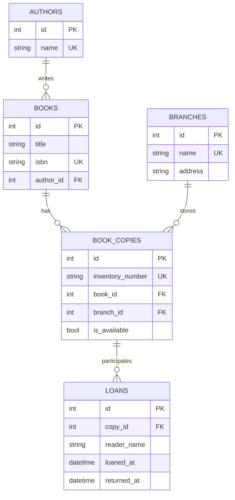

# Схема данных

```mermaid
erDiagram
    AUTHORS ||--o{ BOOKS : writes
    BOOKS ||--o{ BOOK_COPIES : has
    BRANCHES ||--o{ BOOK_COPIES : stores
    BOOK_COPIES ||--o{ LOANS : participates

    AUTHORS { int id PK string name UK }
    BOOKS { int id PK string title string isbn UK int author_id FK }
    BRANCHES { int id PK string name UK string address }
    BOOK_COPIES { int id PK string inventory_number UK int book_id FK int branch_id FK bool is_available }
    LOANS { int id PK int copy_id FK string reader_name datetime loaned_at datetime returned_at }
```

